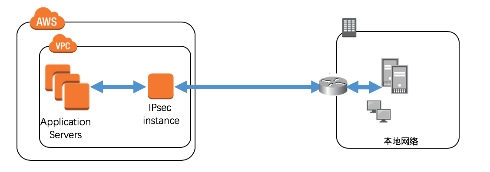
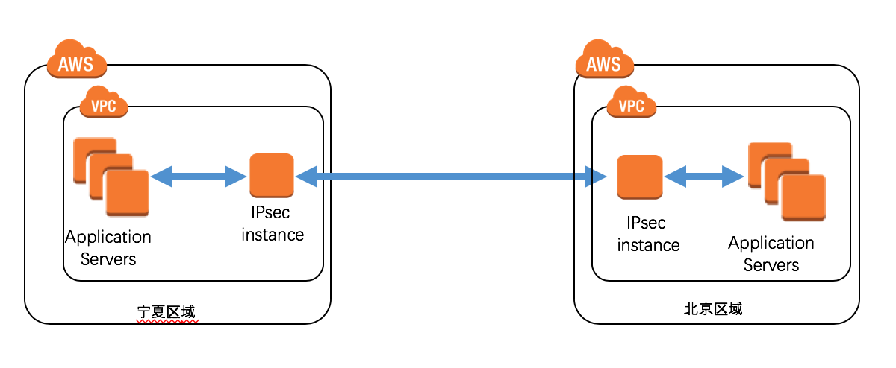
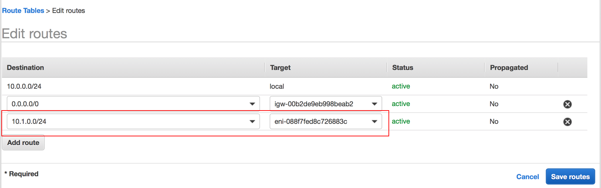

# IpsecVPN
*创建时间: 2019/02/13*
 
 
1. AWS和本地私有网络建立互通
2. AWS中国区域vpc之间建立互通

## 免责说明
建议测试过程中使用此方案，生产环境使用请自行考虑评估。 
当您对方案需要进一步的沟通和反馈后，可以联系 nwcd_labs@nwcdcloud.cn 获得更进一步的支持。 
欢迎联系参与方案共建和提交方案需求, 也欢迎在 github 项目issue中留言反馈bugs。

## 项目说明
1. 适用于AWS中国区域与您的本地私有网络通过IpsecVPN互通场景。此场景要求您的本地办公网络具有支持ipsecvpn功能的路由器或网关。

2. 适用于您在aws中国区域内有多个VPC，两个vpc之间需要互相访问的场景。

 

## 准备工作
需要提前准备好实例的EIP和私有IP。其中，私有IP将在模板中作为参数填入， EIP将在实例创建后进行绑定。

## aws(以宁夏区域为例)与本地网络建立互通操作步骤
 1. 启动宁夏区域模板

    AWS Region   | YAML Format
    ------------ | ------------
    宁夏区域 | 

    参数说明

        参数名称  | 参数含义  | 取值
        --------  | -------- | -----
        InstanceType | 实例类型 | 下拉选择：t2.micro(测试使用),c4.large(正式使用)
        KeyName | EC2登陆密钥对名称 | 下拉选择
        LeftIp | 本EC2内网地址 |  文本框：EC2私网地址
        LeftSubnet | 本端VPC网段地址 | 文本框: 地址网段
        PSK | PreSharedKey | 文本框：字符串
        RightId | 对端ID | 文本框: 此种场景下与RightIP填写一致
        RightIP | 对端IP | 文本框: 对端公网地址
        RightSubnet | 对端网段地址 | 文本框: 地址网段
        SubnetId   | EC2所属子网 | 下拉选择
        Vpc  | EC2所属VPC  | 下拉选择

 2. 将EIP分配给EC2, 并将本端网段地址、EIP告知给对端路由器配置人员做配置。

 3. 修改路由表信息，添加到对端网段的路由。 
    （注：此处以修改VPC路由表为例）

    

 4. 对端路由器配置人员完成后，进行连通性验证。

## aws VPC之间互通操作步骤 （以宁夏区域vpc和北京区域vpc互通为例）

 1. 宁夏区域操作部分同上一段落1-3部分，注意RightId参数需填写对端EC2私网地址。

 2. 启动北京区域模板：
 AWS Region   | YAML Format
 ------------ | ------------
 北京区域 | 

 参数说明

     参数名称  | 参数含义  | 取值
     --------  | -------- | -----
     InstanceType | 实例类型 | 下拉选择：t2.micro(测试使用),c4.large(正式使用)
     KeyName | EC2登陆密钥对名称 | 下拉选择
     LeftIp | 本EC2内网地址 |  文本框：EC2私网地址
     LeftSubnet | 本端VPC网段地址 | 文本框: 地址网段
     PSK | PreSharedKey | 文本框：字符串
     RightId | 对端ID | 文本框: 对端EC2私网地址
     RightIP | 对端IP | 文本框: 对端公网地址
     RightSubnet | 对端网段地址 | 文本框: 地址网段
     SubnetId   | EC2所属子网 | 下拉选择
     Vpc  | EC2所属VPC  | 下拉选择

      

   同样的,按照上一段落中的指导进行EIP绑定和路由表修改。
   完成后，进行连通性验证。

## FAQ
  - 问：为什么方案二中的RightId与RightIp不同？
    对端如果也是ec2 instance, 经测试PEER_ID必须为私网地址。具体可参见/var/log/pluto.log进行分析。原因为EC2用private ip做peering.

  - 问：我需要更改IKE两个阶段的协商参数怎么办？
    本模板为简洁起见，固化了协商参数。如需更改，请自行修改vpnsetup.sh文件，并修改ipsec.yaml增加传入参数。具体参数设置可参看man ipsec.conf
    

## 高可用方案(TODO)

## 参考
-  man ipsec.conf
